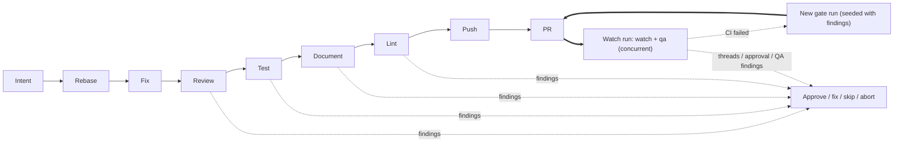

The pipeline runs a fixed, opinionated sequence of steps. Order is not configurable. What each step runs *is*.

A gated push produces a **gate run**, which ends at the PR. Everything after the PR belongs to a **watch run**.

```
gate run:   intent → rebase → fix → review → test → document → lint → push → pr
watch run:  watch  (polls the PR the gate run opened)
            qa     (only when asked for; runs at the same time as watch)
```

The **verify** step is not in the default sequence. It runs an adversarial
re-adjudication of evidence-bound claims and semantic review findings, which
costs a full extra agent session for little marginal value on evidence-thin
changes, so it was taken out of the default pipeline to keep a simple change
fast. Its implementation is retained; see the [Verify
step](/no-mistakes/reference/pipeline-steps/#verify) for what it does and how to
put it back.



This page is the overview. For each step's exact behavior, defaults, skip rules, and fix-commit format, see [Pipeline Steps](/no-mistakes/reference/pipeline-steps/).

## Watch runs

The PR is a boundary in *who owns the state*. Before it, the state is local: a worktree, a git index, agent sessions. After it, the state lives on the SCM server: the PR head, check runs, comment threads, approval. That second kind of state can be re-read at any time, so watching a PR needs no local state at all.

So a gate run ends the moment the PR exists, and releases its worktree. A watch run - a run with `kind: watch` - takes over and polls the PR:

- **CI check runs.** Failing checks are the machine's own mess, and the one signal the pipeline may act on unattended (bounded by [`auto_fix.ci`](/no-mistakes/reference/global-config/#auto_fix)). The watch run does **not** patch the branch itself: it derives a new gate run seeded with the failing checks, so the fix re-crosses review, test, and lint before it reaches the PR.
- **Unresolved comment threads.** One signal covers a human reviewer, a review bot, and an automated QA agent alike - the watch run does not know or care which it is looking at. These always **park and escalate**, never auto-fix. Silently rewriting code in answer to a person's comment is exactly what this tool exists not to do.
- **Approval / mergeability.** A PR whose every check is green and which still cannot merge because nobody has approved it is a real, common state; the watch run parks so a human can be told.

A watch run holds nothing locally, so a daemon restart simply re-arms it and asks the PR again - the PR is never left with nobody watching it. A new push supersedes both the branch's gate run and its watch run, because the head they were built on is gone.

### The QA node

When a run is started with `--with qa` (or `--only qa`), the watch run carries a second node: the [QA step](/no-mistakes/reference/pipeline-steps/#qa). The two run **concurrently** - the PR is polled from the moment it opens, rather than 25 minutes later - and the run holds a worktree (QA has to boot the product) until both have converged. A daemon restart resumes such a run: a QA pass that already finished is reused, and only the poll runs again.

A QA verdict is a statement about **one commit**, and the report says which one. When a fix round moves the PR's head afterwards, the next watch run compares the two commits:

- Only lockfiles, CI config, linter config, docs, or a pure reformat changed: the verdict still describes the product, and it stands.
- Product source changed: the pull request gets a comment naming both commits and every product file that moved between them. QA is **not** re-run - that costs another ~25 minutes, and whether the change could plausibly affect what QA exercised is a judgment call. What is not optional is that the reader can see it.

## What a passed gate means

The pipeline is opinionated so that "passed the gate" has a stable meaning:

- the branch was checked against fresh remote upstream and the pushed-branch target first
- review, tests, user-facing test evidence when available, docs, and lint happened before any branch push to the configured target
- the human stayed in control when a step needed judgment
- the final branch update was guarded against discarding unincorporated commits already on the push target
- push, PR creation, and CI monitoring only happened after the local gate was satisfied

## The nine steps

| # | Step | What it does | Default auto-fix limit |
|---|---|---|---|
| 1 | **Intent** | Use supplied intent or infer it from recent local agent transcripts | n/a |
| 2 | **Rebase** | Fetch fresh remote upstream and the configured branch target, then rebase your branch onto them | `3` |
| 3 | **Review** | AI code review of your diff | `0` (requires approval) |
| 4 | **Test** | Run baseline tests and gather evidence for available intent | `3` |
| 5 | **Document** | Update docs when needed and report unresolved gaps | initial pass |
| 6 | **Lint** | Run lint/static analysis; shares the document step's initial housekeeping pass when no lint command is configured | `3` |
| 7 | **Push** | Safely push the validated branch to the configured target | n/a |
| 8 | **PR** | Create or update the pull request | n/a |
| 9 | **CI** | Watch CI + mergeability, auto-fix failures | `3` |

## Why these steps, in this order

- **Intent first** so downstream agent prompts and generated PR descriptions can include author intent supplied by the agent or inferred from transcripts.
- **Rebase next** so everything else runs against the latest upstream and pushed-branch target.
  It also stops when the branch would silently bundle commits from a local default branch that were never pushed to `origin/<default_branch>`.
  If there's no diff left after the rebase, the pipeline skips the rest.
- **Review before test** so the agent reads fresh code, not code it may have touched during fixes.
- **Document after test** so docs are updated against code that's known to work.
- **Lint last among local checks** so it doesn't churn over code that may still change.
- **Push → PR → CI** happens after all local checks pass.
  The push and CI auto-fix paths refuse to overwrite commits that reached the configured push target out of band.
  CI is the only step that talks to the outside world for validation.

## What each step can do

Every step can:

- **Complete** cleanly and advance the pipeline.
- **Return findings** with severity (`error`, `warning`, `info`) and an action (`auto-fix`, `ask-user`, `no-op`).
- **Trigger auto-fix** if the step's `auto_fix` limit is above 0, the step result is auto-fixable, and any finding is `auto-fix`-eligible. The document step applies safe documentation fixes during its initial pass and, when `commands.lint` is empty, combines that pass with initial safe lint fixes before the lint step consumes its findings.
- **Pause for approval** if blocking findings remain after auto-fix, or if any finding is `ask-user`.
- **Skip** when there's nothing to do (e.g., no diff, unsupported host).
- **Fail** on fatal errors and stop the pipeline.

See [Auto-Fix Loop](/no-mistakes/concepts/auto-fix/) for how the fix cycle works, and [Using the TUI](/no-mistakes/guides/tui/) for what the approval UI looks like.

## What you can configure

You can't reorder steps. You *can*:

- Swap the agent, or configure an ordered fallback list, globally or per-repo.
- Set explicit `commands.test`, `commands.lint`, `commands.format`.
- Store test evidence locally by default or opt into committed in-repo evidence with `test.evidence.store_in_repo`.
- Control auto-fix limits per step.
- Ignore paths during review and documentation checks.
- Disable or tune transcript-based intent extraction when intent is not supplied directly.
- Skip steps for one run with `no-mistakes --skip <steps>`, `git push -o no-mistakes.skip=<steps>`, `no-mistakes axi run --skip <steps>`, or from the TUI.
- Run a single step for one run with `--only <steps>` (the complement of `--skip`), e.g. `no-mistakes axi run --only review`.
- Ask for the on-demand [QA step](/no-mistakes/reference/pipeline-steps/#qa) with `no-mistakes axi run --with qa`. QA boots the product and drives the changed behavior through its real entry points, then reports to the pull request. It runs inside the watch run, concurrently with the CI monitoring, so it delays nothing. It is off in every ordinary run - one pass costs an environment bootstrap and a real browser - so naming it is the only way it runs. Point it at your repository's setup knowledge with [`qa.instructions`](/no-mistakes/reference/repo-config/#qainstructions).

See [Configuration](/no-mistakes/guides/configuration/).

## What you can't configure

- The step order.
- Skipping specific steps permanently - per-run skips are allowed, but the pipeline itself always has all nine.
- Adding new steps.
- Making QA part of every run. It is on-demand by design.

This is intentional. The pipeline is opinionated so that "passed the gate" means the same thing across repos.
